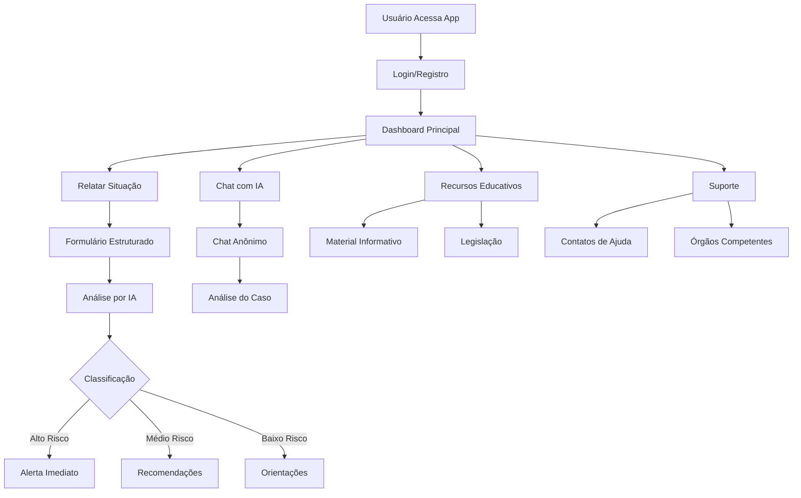

# Det
App para detecção de assédio moral

```mermaid
graph TD
    A[Usuário Acessa App] --> B[Login/Registro]
    B --> C[Dashboard Principal]
    
    C --> D[Relatar Situação]
    C --> E[Chat com IA]
    C --> F[Recursos Educativos]
    C --> G[Suporte]

    D --> H[Formulário Estruturado]
    H --> I[Análise por IA]
    
    I --> J{Classificação}
    J -->|Alto Risco| K[Alerta Imediato]
    J -->|Médio Risco| L[Recomendações]
    J -->|Baixo Risco| M[Orientações]
    
    E --> N[Chat Anônimo]
    N --> O[Análise do Caso]
    
    F --> P[Material Informativo]
    F --> Q[Legislação]
    
    G --> R[Contatos de Ajuda]
    G --> S[Órgãos Competentes]
```
