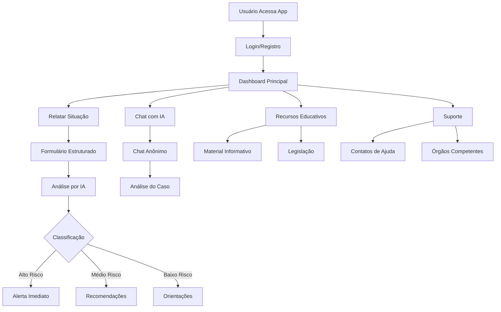

# Detecção de assédio
O objetivo do aplicativo é detectar e oferecer suporte para quem está sofrendo assédio moral.


# Estrutura do Projeto

```
Detecção de assédio/
├── frontend/               # React Frontend
│   ├── src/
│   │   ├── components/     # Componentes React
│   │   ├── pages/          # Páginas da aplicação
│   │   ├── services/       # Serviços de API
│   │   ├── contexts/       # Contextos React
│   │   └── hooks/          # Custom hooks
│   └── package.json
│
├── backend/                # Python Backend
│   ├── app/
│   │   ├── routes/         # Rotas da API
│   │   ├── models/         # Modelos do banco
│   │   ├── services/       # Lógica de negócio
│   │   └── ai/             # Integrações com IA
│   ├── requirements.txt
│   └── main.py
│
└── docker-compose.yml       # Configuração dos containers
```

